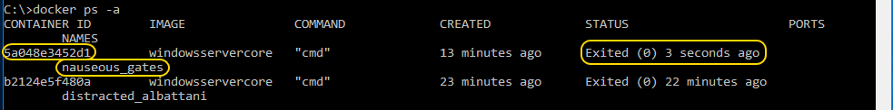

# Setup an IIS enabled Docker Image #

## Challenge ##
Getting started with Docker can be quite a challenge, but it is actually quite straightforward. Once you know the basics to get started, new perspectives will open up.

## Prerequisites ##
To get started with this mini-hack, you need a Virtual Machine where you can run Docker images. Windows 2016 has the possibility to run Docker images natively. Windows 10 also has this possibility. This mini-hack uses a Windows 2016 Server Core image that is available in the Azure Gallery.

- Log in to your Azure Account
- Click the New Button on the left hand side 
- Search for [Windows Server 2016 Core with Containers Tech Preview 5] and select the image 
- Create the new image by following the steps in the wizard
- Set up a Remote Desktop connection and login to the Virtual Machine you just created

## The Assignment ##

### Step 1 - Validate your Docker Deployment ###
Log in to the virtual machine and validate your Docker Host by typing the following command on a command line

   ```
   docker run -ti windowsservercore cmd
   ```

This starts up (docker run) a clean Windows Server Core docker container (windowsservercore) in terminal mode (-ti) and opens the command line in this container (cmd)


Exit the container by typing

   ```
   exit
   ```

Try the following commands 

List all available images

   ```
   docker images
   ```

List all running containers

   ```
   docker ps
   ```
List all running and stopped containers

   ```
   docker ps -a
   ```

### Step 2 - Start a container and enable IIS ###
Start a new windowsservercore container. Once inside the container enter Powershell Mode by typing the following on the command line. 

   ```
   powershell
   ```

Install the Web server feature in this container by typing.

   ```
   Install-WindowsFeature Web-Server
   ```
    
Also install the following components in your container
- Web-Asp-net45
- Web-Windows-Auth

### Step 3 - Save your container as new base image ###
Now that you have prepared the container you can save this container as a new base image.

Exit the container and type 

   ```
   docker ps -a
   ```

to list all the stopped container. Find the container that was most recently stopped and take note of the name.	



To save the current state of the container in a new container image you can commit the container by typing 

   ```
   docker commit <container-hid-hash> techdaysmh:iisbase
   ```

When the commit completes, run the command follwing command and see that your image is there!

   ```
   docker images
   ```

## Finished! ##
You have successfully finished this Mini-Hack! Please notify a Mini-Hack host show them the following result(s);

- show us the running iis container 

After validation by the host you can use the TechDays 16 app to unlock the a Mini-Hack specific badge!

If you do not have the TechDays 16 App yet be sure to download it;
- iOS <https://xpir.it/td16-ios>
- Android <https://xpir.it/td16-droid>
- Windows Phone <https://xpir.it/td16-win>