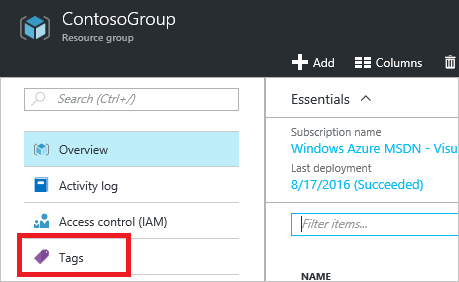
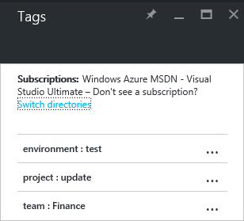

# Tagging Azure Resources in Azure Manager Portal#

## Challenge ##
Getting your Azure Resource Manager resources organized by tagging helps you to create order in chaos. This minihack shows the basics of resource tagging.

## Prerequisites ##
You will need an Azure Account with some Resource Manager resources.

## The Assignment ##
Tag an Azure RM resource in the Azure portal and add it to your dashboard.

### Step 1 - Add tag ###
To add tags to existing resources and resource groups, select the tag icon.

### Step 2 - Add tag ###
You see a list of tags that your organization has already applied to resources. If you have not previously applied tags, the list is empty. To add a tag, simply specify a name and value and press Enter. After you've added a few tags, you'll notice autocomplete options based on pre-existing tag names and values. These autocomplete options ensure a consistent taxonomy across your resources and avoid common mistakes, like misspellings.

### Step 3 - View taxonomy ###
To view your taxonomy of tags in the portal, select More Services and Tags.

### Step 4 - Tag in Subscription ###
You see a summary of the tags in your subscription.

### Step 5 - Display tags ###
Select any of the tags to display the resources and resource groups with that tag.

### Step 6 - Dashboard ###
Pin the most important tags to your Dashboard for quick access.

## Finished! ##
See the tags in the portal dashboad!

Read more: https://azure.microsoft.com/en-us/documentation/articles/resource-group-using-tags/#portal
